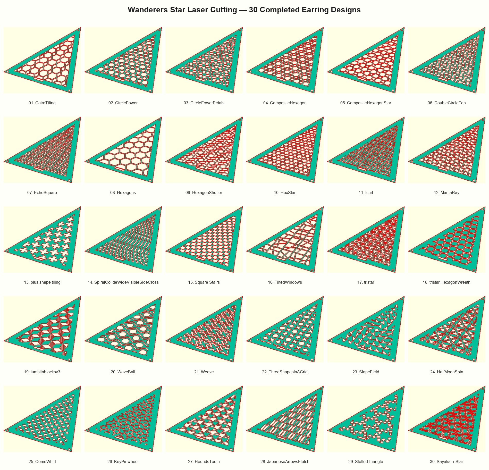

# Wanderers Star Laser Cutting

OpenSCAD source files for laser-cut earring designs, organized into three folders:

- **`Complete/`** — finished designs (`Complete_NN_Name.scad`), each framed in the golden-triangle earring border and ready to cut.
- **`Incomplete/`** — work-in-progress drafts (`Incomplete_Name.scad`).
- **`Templates/`** — one blank reference template per wallpaper symmetry group (`p1`, `p2`, `pm`, `pg`, `cm`, `pmm`, `pmg`, `pgg`, `cmm`, `p3`, `p3m1`, `p31m`, `p4`, `p4m`, `p4g`, `p6`, `p6m`), plus `GoldenTriangle_Blank_Template.scad` for the frame itself.

## Completed designs

